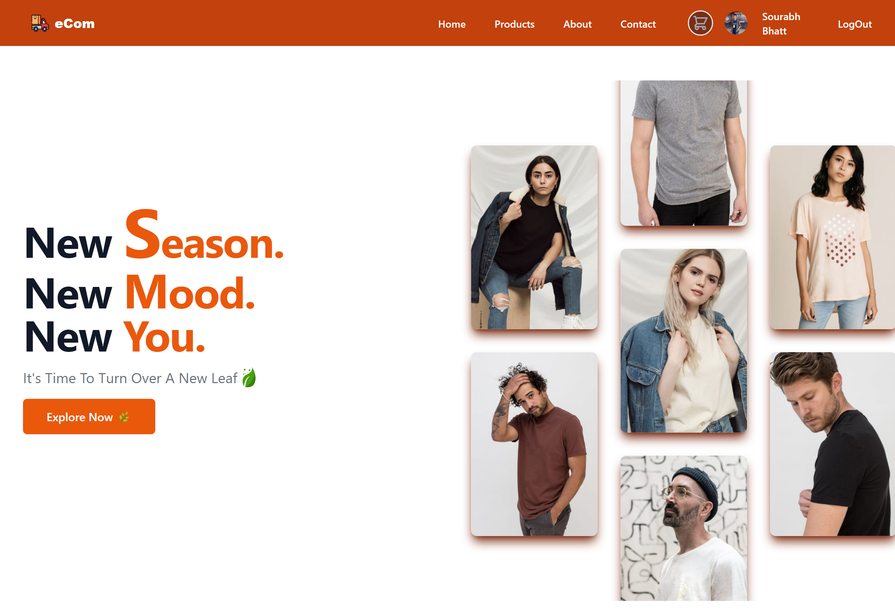
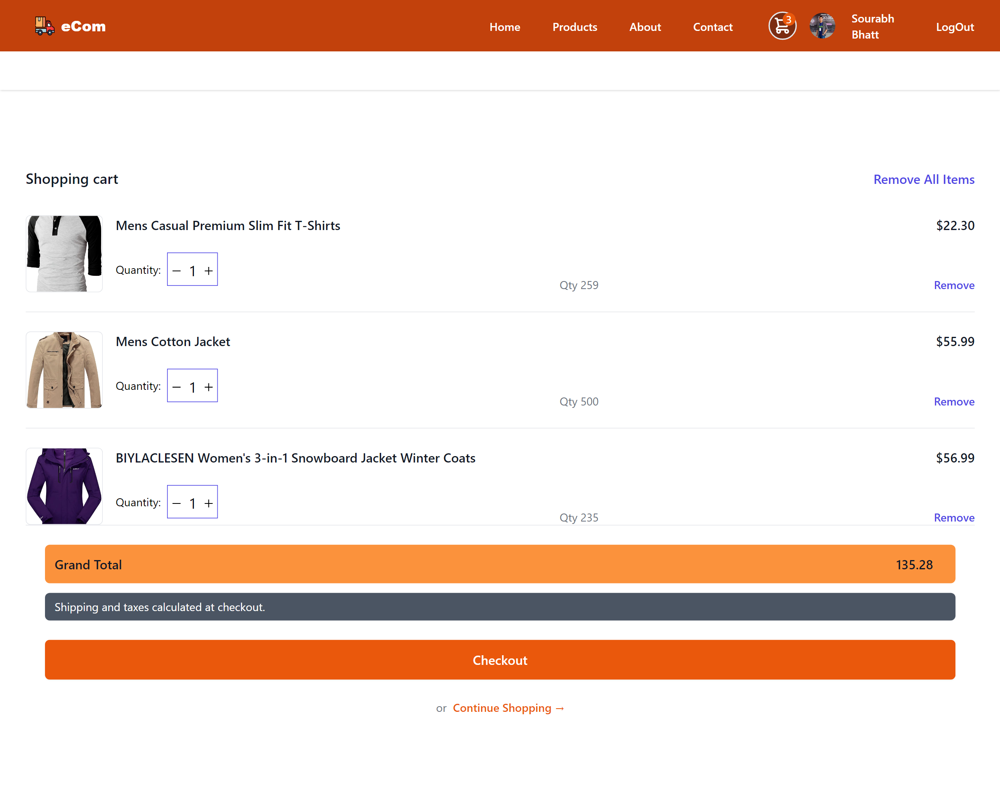
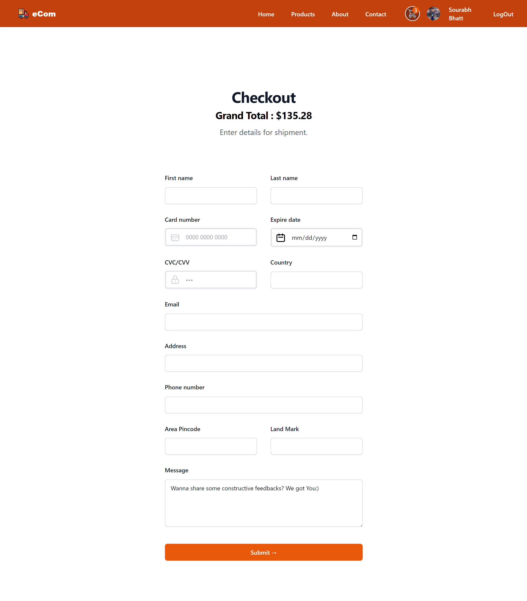
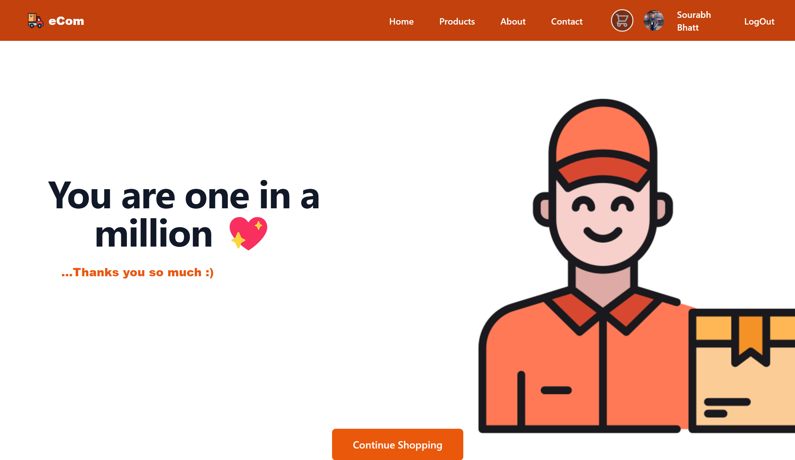
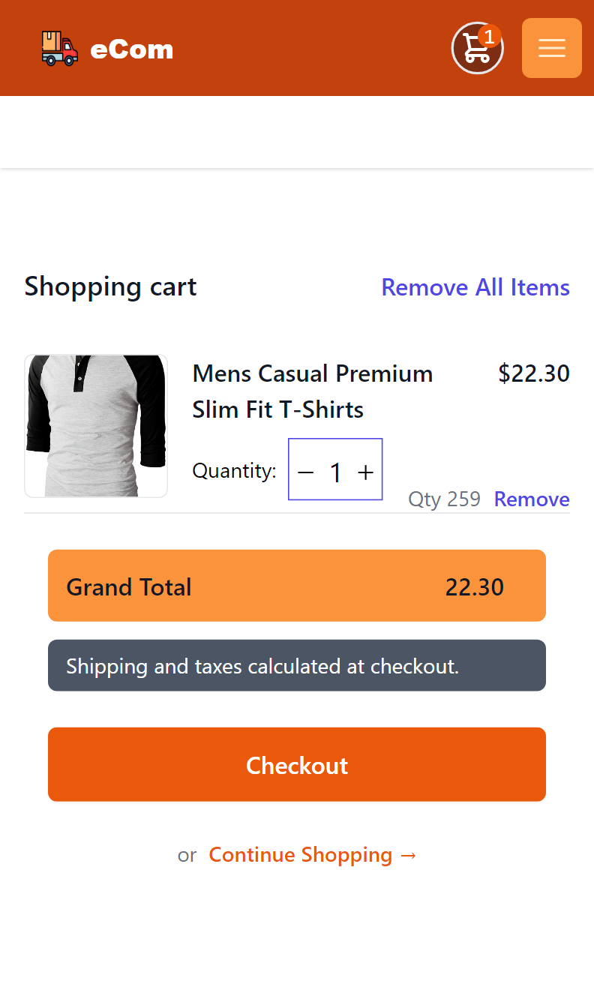
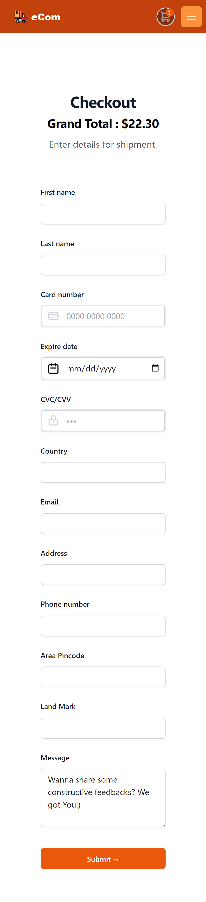
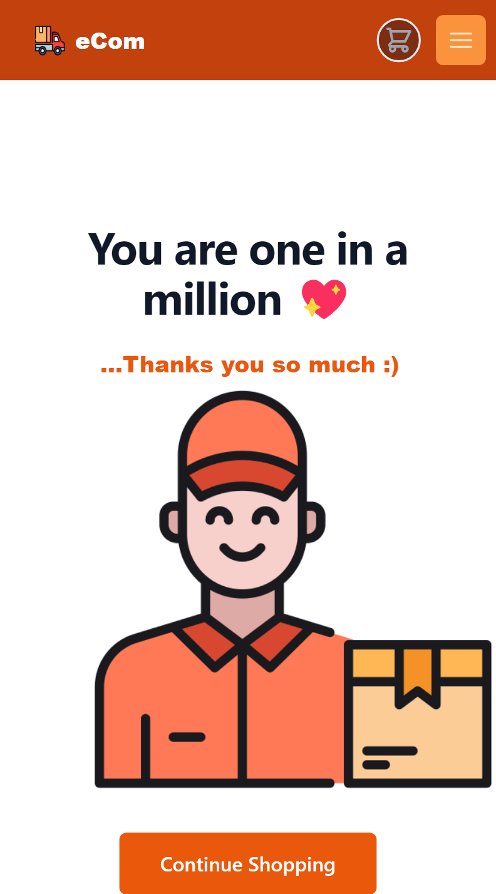

# E-Commerce Website

Welcome to my E-Commerce website project. It is an e-commerce website built using React.js and Tailwind CSS.

## Overview

This project replicates a shopping site with essential features, including:

### Product Listing:

- Displays a variety of products with images, names, prices, and "Add to Cart" buttons.
- Implements filters to allow users to sort products by category, price range, or ratings.

### Shopping Cart:

- Implements a cart section to display the added products, quantities, and total cost.
- Allows users to increase, decrease, or remove items from the cart.
- Displays real-time updates of the cart total and item count.

### Checkout:

- Implements a checkout process that calculates the total cost of items in the cart.
- Allows users to enter shipping information and payment details.

### Responsive Design:

- Ensures the website is responsive and works seamlessly on both desktop and mobile devices.
- Optimizes the layout for different screen sizes.

### Additional Features also implemented:

## Tech Stack

- React.js
- Tailwind CSS

## Project Structure

- `/public`: Static assets.
- `/src`: Contains the source code of the project.
  - `/assets`: Contains the assets.
  - `/components`: Organized components for different sections of the website.
  - `/data`: Contains data of the fake api store images.
  - `/others`: Custom styles and Tailwind CSS classes.

## Getting Started

To run this project locally, follow these steps:

1. Clone this repository to your local machine.
2. Navigate to the project directory.
3. Install dependencies using `npm install` or `yarn install`.
4. Start the development server using `npm start` or `yarn start`.
5. Open your browser and visit `http://localhost:3000` to view the website.

## Live Demo

You can access the live demo of this project at (Put my own url here).

## Project Screenshots

Take a visual tour of the E-Commerce website in action. I've captured the essence of the project in both desktop and mobile views to showcase its responsive design.

**Desktop View:**

1. Home Page

2. Products Page

3. Cart Page

4. Checkout Page

5. Exit Page

_Experience the full feature set and ease of navigation on larger screens._

**Mobile View:**

1. Home Page

2. Products Page

3. Cart Page

4. Checkout Page

5. Exit Page

_Enjoy a seamless shopping experience on your mobile device, with a responsive layout._

These screenshots provide a glimpse into the user-friendly design and functionality of the website, whether you're browsing from a desktop or a mobile device.

Thank you for reviewing my project!
